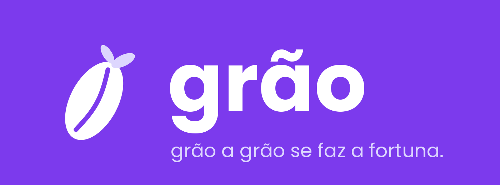
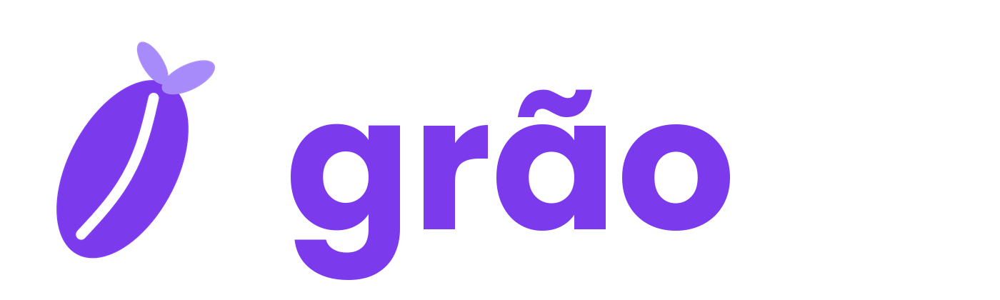

<p align="center">
  
</p>

# Grão

Controle financeiro para quem ainda está aprendendo a lidar com dinheiro: o estudante universitário.

> *"Grão a grão se faz a fortuna."*

**Disciplina:** Cross-Platform Application Development — FIAP 2026
**Professor:** Hercules Ramos
**Tecnologia:** Flutter / Dart + Supabase

## Integrantes

| Nome | RM |
|---|---|
| Ana Luiza Bertão | RM563171 |
| Sofia Franken | RM562767 |

---

## O que é o Grão

Um app para anotar o que entra e o que sai, ver pra onde o dinheiro foi e não chegar no fim do mês sem entender o que aconteceu. Sem planilha, sem termo técnico, sem cadastro de banco.

## O problema

Muito estudante passa aperto não por ganhar pouco, e sim por não enxergar os próprios gastos. Os apps de banco são pesados e falam em "linguagem de adulto"; planilha a gente abandona em uma semana. O resultado é o mesmo de sempre: o dinheiro acaba e ninguém sabe onde foi.

## Para quem é

- Universitários de 18 a 25 anos
- Quem recebe mesada, bolsa ou salário de estágio
- Quem está começando a se organizar financeiramente
- Quem prefere resolver tudo no celular

## O que o app faz (MVP)

| Funcionalidade | O que faz | Status |
|---|---|---|
| Resumo do mês | Quanto sobrou, quanto entrou e quanto saiu, com navegação entre meses | CP5 |
| Anotar gasto ou entrada | Valor, tipo, categoria, data e descrição — em poucos toques | CP5 |
| Categorias | Alimentação, Transporte, Lazer, Estudos, Moradia, Saúde, Rolê e Outros (entradas: Mesada, Estágio, Bolsa e Extra) | CP5 |
| Histórico | Lista por dia, com busca, filtro por tipo e por período; toque para ver, editar ou excluir; arrastar para excluir com "Desfazer" | CP5 |
| Metas de gasto | Limite mensal por categoria, com barra de progresso e aviso de quando está perto de estourar | CP5 |
| Gráfico de pizza | Gasto por categoria, em rosca, na tela inicial | CP5 |
| Perfil | Nome, status da conexão com o banco, dados de exemplo e prévia do Premium | CP5 |

---

## Marca

### Por que "Grão"

1. **Conceito:** o ditado diz que pequenas economias, repetidas, viram fortuna. É exatamente a ideia do app.
2. **Memorabilidade:** curto, fácil de falar, brasileiro e diferente dos nomes de sempre em finanças.
3. **Tom:** simpático, sem cara de banco.

### Tom de voz

O Grão fala como um amigo que entende de dinheiro: direto, sem julgar e sem jargão. Exemplos de como isso aparece no app:

| Em vez de... | O Grão diz... |
|---|---|
| "Saldo negativo detectado" | "Esse mês saiu mais do que entrou. Dá uma olhada no gráfico pra ver onde apertar." |
| "Meta excedida em R$ 20,00" | "Passou R$ 20,00 do limite" |
| "Nenhum registro encontrado" | "Nada por aqui. Não tem anotação nesse filtro ainda." |
| "Valor inválido" | "Coloca um valor primeiro." |

As frases ficam concentradas em `lib/utils/micro_copy.dart`, para o tom ficar consistente.

### Logo

Um grão com o sulco no meio e um brotinho no topo: é a semente do dinheiro que cresce aos poucos.

<p align="center">
  
</p>

Arquivos em `docs/img/` (para documentação) e `assets/images/` (usados no app). O ícone do app já está aplicado em Android, iOS, web, macOS e Windows.

### Paleta

| Token | Hex | Uso |
|---|---|---|
| `primary` | `#7C3AED` | Cor principal, botões, cabeçalhos |
| `primaryLight` | `#A78BFA` | Detalhes e elementos secundários |
| `primaryDark` | `#5B21B6` | Peso visual, card Premium |
| `background` | `#F5F3FF` | Fundo das telas |
| `surface` | `#FFFFFF` | Cards |
| `income` | `#10B981` | Entradas |
| `expense` | `#EF4444` | Saídas |
| `textDark` | `#1E1B4B` | Títulos e texto principal |
| `textGray` | `#6B7280` | Texto secundário |

### Tipografia

Poppins, empacotada no próprio app (funciona offline): títulos 24, subtítulos 18 (Medium), corpo 14 e labels 12. Detalhes em [`docs/decisoes-tecnicas.md`](docs/decisoes-tecnicas.md).

---

## Pitch

### Por que o Grão existiria

Mobills e Organizze atendem adultos com renda fixa. O Grão nasce da rotina do estudante:

- **Começo rápido:** nada de ligar conta de banco nem entregar dado sensível.
- **Anotar em ~10 segundos:** teclado numérico, categoria e pronto.
- **Linguagem de estudante:** categorias como "Rolê" e "Bandejão", e frases que não parecem boleto.
- **Metas visuais:** barra de progresso que avisa antes de estourar.

### Modelo de negócio

- **Gratuito:** o essencial para controlar o mês.
- **Grão Premium (R$ 9,90/mês):** histórico ilimitado, relatórios avançados e sincronização entre aparelhos.
- **Parcerias:** cupons de restaurantes, livrarias e streaming dentro do app.

### Mercado

Cerca de 9,4 milhões de universitários no Brasil (dado de INEP 2023 citado no CP4). Com 0,1% de conversão para o Premium, são cerca de 9.400 assinantes, ou aproximadamente **R$ 1,1 milhão por ano** (9.400 × R$ 9,90 × 12).

---

### Fluxo de telas

```
Splash ──► Onboarding (3 telas) ──► App
                                     ├─ Início ──► Anotar (novo) / detalhe da anotação ──► Editar
                                     ├─ Histórico ──► detalhe ──► Editar / Excluir (com Desfazer)
                                     ├─ Metas ──► definir / mudar / tirar meta
                                     └─ Eu ──► editar nome, restaurar dados, rever introdução
```

Na segunda abertura, o onboarding é pulado e o app vai direto para o Início.

### Dados de exemplo

Ficam em `lib/data/mock_data.dart` e são gerados a partir da data de hoje, então o app sempre tem movimento no mês atual, no passado e no retrasado. Casos cobertos de propósito:

- mês atual com saldo positivo e todas as metas no verde;
- mês passado com uma meta estourada (Rolê) e outra no limite;
- dois meses atrás fechando no vermelho;
- valores pequenos (R$ 4,50), grandes (R$ 1.450,00) e com centavos;
- entradas de tipos diferentes: mesada, estágio, bolsa e freela.

### Banco de dados (Supabase)

O app fala com os dados por uma interface (`GraoRepository`) com duas implementações:

| Implementação | Quando é usada |
|---|---|
| `SupabaseRepository` | Quando as chaves do Supabase são passadas na execução |
| `MockRepository` | Sem chaves, sem internet ou se o Supabase falhar (a tela **Eu** avisa) |

**Como ligar o Supabase**

1. Crie um projeto em [supabase.com](https://supabase.com).
2. No **SQL Editor**, rode o conteúdo de [`supabase/schema.sql`](supabase/schema.sql).
3. Em **Project Settings → API**, copie a *Project URL* e a chave *anon public*.
4. Rode o app passando as chaves (elas **não** entram no código nem no Git):

```bash
flutter run \
  --dart-define=SUPABASE_URL=https://SEU-PROJETO.supabase.co \
  --dart-define=SUPABASE_ANON_KEY=SUA-CHAVE-ANON
```

Na primeira vez com o banco vazio, o app já o preenche com os dados de exemplo.

### Como rodar

```bash
git clone https://github.com/sofiafrankenn/grao_desenvolvimento_flutter.git
cd grao_desenvolvimento_flutter
flutter pub get
```

Depois, escolha onde rodar:

```bash
# Emulador Android (abra um no Android Studio antes)
flutter run

# Navegador (Chrome)
flutter run -d chrome

# Windows desktop
flutter run -d windows
```

Para ver os dispositivos disponíveis: `flutter devices`.

### Testes

```bash
flutter test
```

### Estrutura do projeto

```
lib/
├── main.dart                  # inicialização e escolha do repositório
├── config/env.dart            # chaves do Supabase via --dart-define
├── data/                      # repositório: interface, mock e Supabase
├── models/                    # Transaction, Category, Goal
├── state/app_state.dart       # estado do app e acesso aos dados
├── screens/                   # splash, onboarding, início, histórico, anotar, metas, eu
├── widgets/                   # logo, saldo, item de lista, categoria, gráfico, meta
├── theme/                     # cores e tema (CP4)
└── utils/                     # formatação e frases do app
assets/
├── images/                    # logo e marca
└── fonts/                     # Poppins
supabase/schema.sql            # tabelas do banco
docs/                          # imagens, decisões técnicas e roteiro de apresentação
```